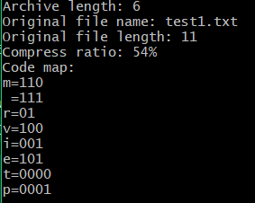

# Проект кодирование и декодирование файлов с помощью алгоритма Хаффмена

## Описание проекта

Проект представляет собой приложение на языке Java, предназначенное для кодирования и декодирования текстовых данных с использованием алгоритма Хаффмана, а также для получения информации о закодированном файле. Алгоритм Хаффмана - это метод сжатия данных, основанный на построении оптимального префиксного бинарного дерева.

## Структура проекта

Проект разделен на несколько компонентов:

1. **`Huffman` (Основной класс)**
   - Основной класс приложения, содержащий главный метод для выполнения.

2. **`BitInputStream` и `BitOutputStream`**
   - Классы для удобного ввода и вывода битовых данных.

3. **`Node`**
   - Класс, представляющий узел в кодирующем дереве.

4. **`FileUtility`**
   - Утилитарный класс с полезными функциями.

5. **`FileWriter`**
   - Класс для записи закодированных и декодированных данных в файлы.

6. **`FileReader`**
   - Класс для чтения файлов и получения информации о размере сжатого файла.

7. **`HuffmanEncoder`**
   - Класс, служащий утилитой для генерации кодов Хаффмана, построения деревьев Хаффмана и отображения кодов Хаффмана для отдельных символов.

## Запуск проекта

Проект поддерживает следующие режимы:

- **`encode`** - Закодировать файл.
- **`decode`** - Декодировать сжатый файл.
- **`info`** - Получить информацию о сжатом файле.

Примеры запуска:

```bash
java Huffman encode input.txt
java Huffman decode input.ark
java Huffman info input.ark
```

## Пример

пример входного файла 

информация о закодированном input.arc 
