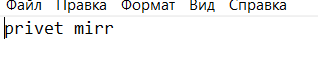

# Проект кодирование и декодирование файлов с помощью алгоритма Хаффмена

## Описание проекта

Проект представляет собой приложение на языке Java, предназначенное для кодирования и декодирования текстовых данных с использованием алгоритма Хаффмана, а также для получения информации о закодированном файле. Алгоритм Хаффмана - это метод сжатия данных, основанный на построении оптимального префиксного бинарного дерева.


## Запуск проекта

Проект поддерживает следующие режимы:

- **`encode`** - Закодировать файл.
- **`decode`** - Декодировать сжатый файл.
- **`info`** - Получить информацию о сжатом файле.

Примеры запуска:

```bash
java Main encode input.txt
java Main decode input.ark
java Main info input.ark
```

## Пример

пример входного файла 

информация о закодированном input.arc 
